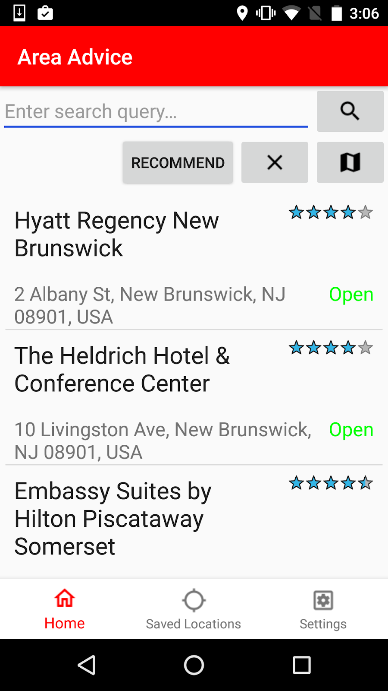

# Area Advice
Have you ever been in a situation where you have no clue where to go? With the Area Advice app, you can search for anything nearby and filter by distance or ratings, whether or not it's open. But what makes this different from a typical Google search is the app's ability to give recommendations based on sensor data. If your Android phone contains a temperature or light sensor, you can get suggested areas based on how hot or cold the weather is or whether it's day or night. You can then view more info about the location, save it for later, and view it on the map as a marker. Next time you're trying to decide a place among your group, or trying out a new place, try our app out and see what you get.

## Features

- Search by query using the Google Places API
- A recommendation system based on temperature and light sensors
- Save & delete locations on a database
- A Google Map containing your location and saved locations
- Detailed location pages containing hours, reviews, distance, and more
- Settings to toggle sensor recommendations, search radius, units, distance/ratings, and open locations
- Persisted settings and saved locations

## Requirements
With Android Studio, you can clone and run a local copy onto the emulator or on your Android phone. Make sure to open the build.gradle file so that the app can be built properly on your device. You must give permission to access your location to be able to search for places. You can check the settings tab to see if your device supports temperature or light sensors and their current readings.

**API Key**: An API key is required to use Google Maps and the Google Places API. Go to Google Cloud to activate your API key and place it as a string resource called "google_places_key" in a file called google_apis.xml. Don't worry, Git will ignore this file so your key is safe.
